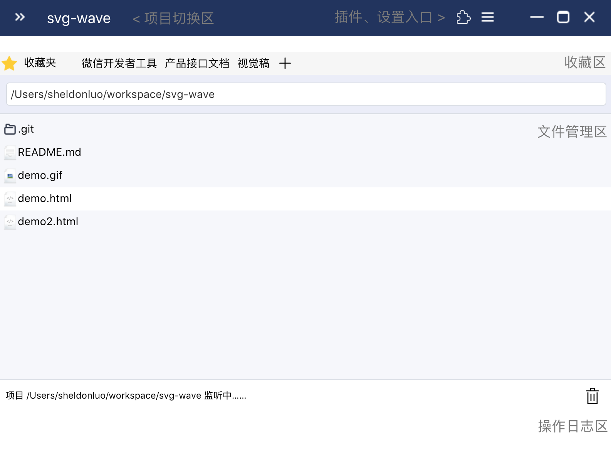
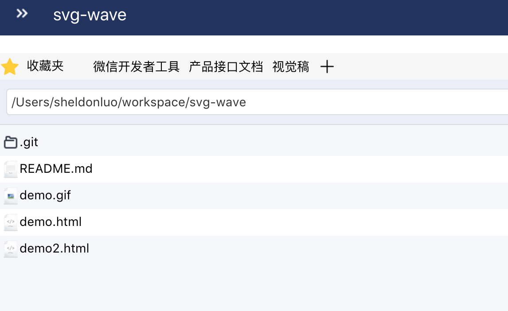
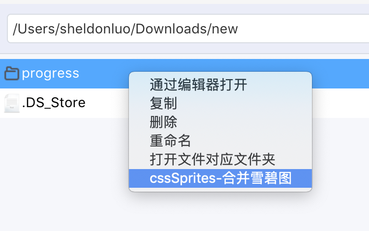
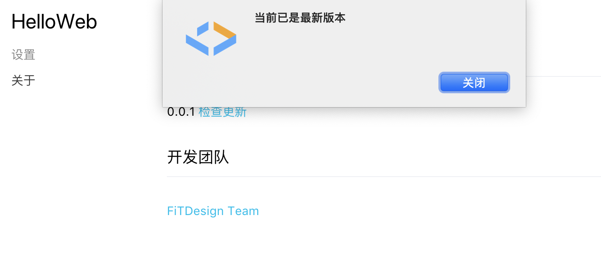
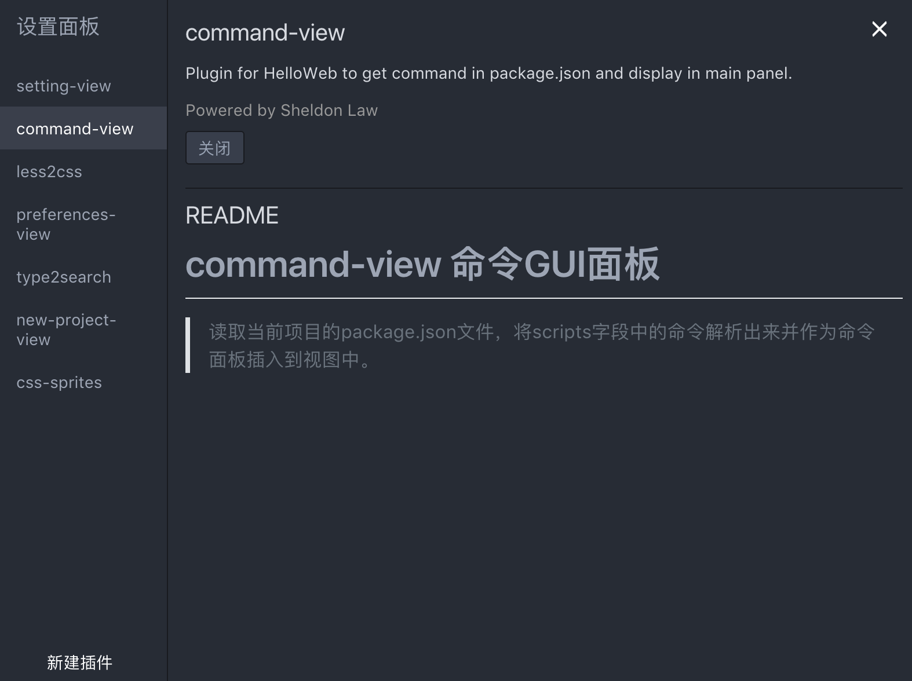

# HelloWeb
> The tool to change the way you build the web.

[项目官网](https://fitdesignteam.github.io/HelloWeb/home.html)

HelloWeb是可视化和可个性化定制的web前端开发平台，致力于通过提供web开发解决方案来提升开发效率和提高输出质量，其中包括环境搭建，开发，打包构建，发布。

*目前仅处于初级验证阶段，欢迎反馈讨论。*

### 功能

#### 基础功能

一，快速新建项目，一键启动

> 只想写个简单的h5 Demo又不想配置本地服务器？HelloWeb帮你一键server & 自动刷新预览界面。

二，项目相关收藏夹

> 项目很多？相关文件找不到？快将项目常用的文件、文件夹、应用等固定在收藏栏吧，一键打开，无需再苦苦寻找。

三，可扩展的右键菜单

> 扩展功能可以通过插件系统来实现，下面👇会介绍支持自定义一切的插件系统！图片base64转化，图片css转化...更多功能等你来探索和开发。

四，自动更新

> 虽然现在处于初阶验证阶段，但新特性发布时你能第一时间体验到！希望能多提issue反馈，说不定你吐槽的地方已经被修复了。

#### 个性化定制

HelloWeb采用微核架构（插件架构）来组织代码，将每一功能特性的复杂度收拢在单一插件，系统核心只负责插件的加载和调度，实现高内聚低耦合。同时给用户提供自由开发插件的能力，实现个性化定制。

##### 目前已实现插件

1. Command-view: package.json命令可视化，点击执行
2. Type2search: 文件管理面板，按字母定位文件
3. Css-sprite: 雪碧图合成插件

##### 插件开发

新建插件 =》在编辑器打开 =》开发 =》重启验证

1. [插件开发文档](./plugin.md)
2. 插件调试：
   1. Mac cmd + shift + i
   2. Windows ctrl + shift + i

##### 关于插件

目前HelloWeb对插件没有任何约束，理论上能实现所有功能，欢迎大家大开脑洞和我们分享有用有趣的插件，也欢迎提issue让我们帮忙评估实现你想要的插件。

### 待实现

> 梦想还是要有的。

一，实现任务流构建架构

参考[koa](https://github.com/koajs/koa)实现基于中间件（插件）的任务流架构，将构建抽象成多个有序任务，能简单增加个性化的构建操作，轻松打造适合自己项目的构建流。

二，通过中间件 or 插件集成更多web开发解决方案

web是一个美好的地方，这些年随着网速和硬件设备的快速发展，web中产生了许多优质的应用，HelloWeb的目标在于降低优质web应用的开发成本，希望让更多人参与到web中来。

三，支持插件发布更新

### JOIN US

目前我们只是对外发布安装包，后续希望能开源代码，目前大家能以下面的形式参与进来：

1. 发现bug，提issue；
2. 对于HelloWeb的任何看法，欢迎邮件 or issue沟通；
3. 开发插件并联系我们更新到最新的HelloWeb中（后续将直接支持开源社区的插件安装）；
4. 有任何迫切需要的通用功能，提issue；
